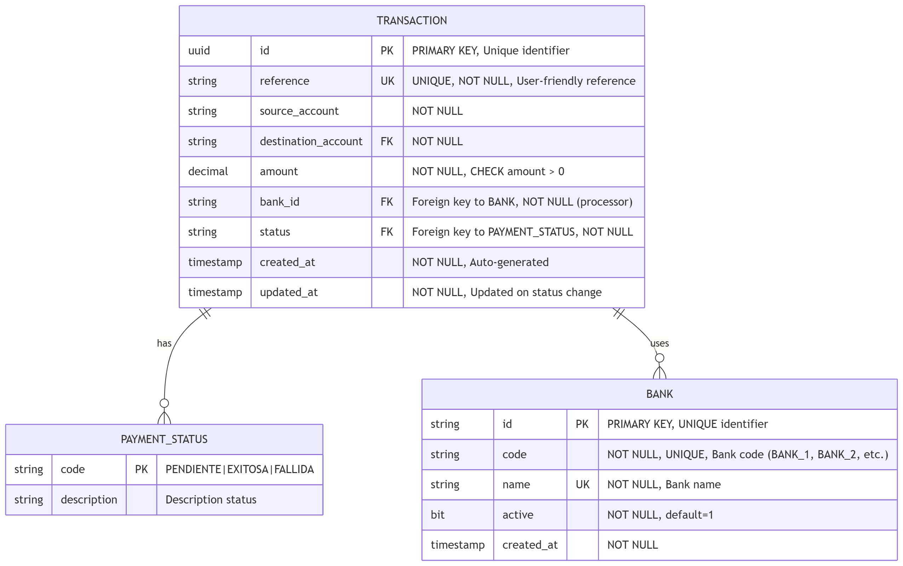

# Database Schema - Interbank Payment Orchestrator

---

## 📊 Entity-Relationship Diagram (ER)



---

## 🗄️ Detailed Definition of Tables

### 1. **TRANSACTION** (Principal)

| Columna | Tipo | Constraints | Índices | Descripción |
|---------|------|-------------|---------|-------------|
| `id` | UUID | PK, NOT NULL | CLUSTERED PRIMARY KEY | Identificador único de la transacción |
| `reference` | VARCHAR(50) | UK, NOT NULL | UNIQUE INDEX | Referencia única generada por el cliente/sistema |
| `source_account` | VARCHAR(20) | FK (BANK), NOT NULL | NON-CLUSTERED | Banco origen (cuenta del remitente) |
| `destination_account` | VARCHAR(20) | NOT NULL | NON-CLUSTERED | Banco destino (cuenta del beneficiario) |
| `amount` | DECIMAL(18, 2) | CHECK > 0, NOT NULL | NON-CLUSTERED | Monto a transferir (18 dígitos, 2 decimales) |
| `bank_id` | VARCHAR(20) | FK (BANK), NOT NULL | NON-CLUSTERED | Banco processor (BANK_1, B2, etc.) |
| `status` | VARCHAR(20) | FK (PAYMENT_STATUS), NOT NULL | NON-CLUSTERED | Estado actual (PENDIENTE, EXITOSA, FALLIDA) |
| `created_at` | TIMESTAMP | NOT NULL, DEFAULT GETUTCDATE() | NON-CLUSTERED | Fecha/hora de creación |
| `updated_at` | TIMESTAMP | NULL | NON-CLUSTERED | Última actualización de estado |

**Purpose**: To store all interbank transactions with full auditing.

**Recommended Indexes**:
```sql
-- Quick search by reference
CREATE UNIQUE INDEX IX_TRANSACTION_REFERENCE ON TRANSACTION(reference);

-- Search for pending transactions
CREATE INDEX IX_TRANSACTION_STATUS_CREATED ON TRANSACTION(status, created_at);

-- Analysis by bank
CREATE INDEX IX_TRANSACTION_BANK_ID ON TRANSACTION(bank_id);

-- Reconciliation by date
CREATE INDEX IX_TRANSACTION_CREATED_AT ON TRANSACTION(created_at DESC);
```

---

### 2. **PAYMENT_STATUS** (Catalog)

| Columna | Tipo | Constraints | Descripción |
|---------|------|-------------|-------------|
| `code` | VARCHAR(20) | PK, NOT NULL | Código de estado (PENDIENTE, EXITOSA, FALLIDA) |
| `description` | VARCHAR(255) | NOT NULL | Descripción legible (ej: "Pendiente de confirmación del banco") |

**Possible values**:

| Código | Descripción |
|--------|-------------|
| `PENDIENTE` | Pendiente de confirmación del banco externo |
| `EXITOSA` | Transferencia completada exitosamente |
| `FALLIDA` | Transferencia rechazada por banco |

---

### 3. **BANK** (Bank Catalog)

| Columna | Tipo | Constraints | Descripción |
|---------|------|-------------|-------------|
| `id` | VARCHAR(20) | PK, NOT NULL | Identificador único (BANK1, BANK2, etc.) |
| `code` | VARCHAR(50) | NOT NULL | URL del endpoint REST del banco |
| `name` | VARCHAR(100) | UK, NOT NULL | Nombre del banco (Banco1, Banco2) |
| `active` | BIT | NOT NULL, DEFAULT 1 | Indica si el banco está activo |
| `created_at` | timestamp | NOT NULL| Fecha/hora de creación  |

---
## 🔍 Common Queries

### Get all pending transactions from a bank:
```sql
SELECT t.* 
FROM TRANSACTION t
WHERE t.bank_id = 'BANK1' 
  AND t.status = 'PENDING'
  AND t.created_at > DATEADD(hour, -2, GETUTCDATE())
ORDER BY t.created_at DESC;
```

### Reconciliation: Transactions completed without updating DB:
```sql
SELECT t.* 
FROM TRANSACTION t
WHERE t.status = 'COMPLETED' 
  AND t.updated_at IS NULL;
```

### Transfer statistics by bank:
```sql
SELECT 
    t.bank_id,
    COUNT(*) as total_transfers,
    SUM(t.amount) as total_amount,
    COUNT(CASE WHEN status = 'COMPLETED' THEN 1 END) as successful,
    COUNT(CASE WHEN status = 'FAILED' THEN 1 END) as failed
FROM TRANSACTION t
WHERE t.created_at >= DATEADD(day, -30, GETUTCDATE())
GROUP BY t.bank_id
ORDER BY total_amount DESC;
```

### Audit: All transactions of a user/reference:
```sql
SELECT * 
FROM TRANSACTION 
WHERE reference LIKE 'USER123%'
ORDER BY created_at DESC;
```

---

## 📊 Statistics and Partitioning

### Expected Volume Considerations:
- **30 TPS** = ~2.6 million transactions/day
- **Annual Projection**: ~950 million records

### Partitioning Strategy (Future):
```sql
-- Partition by month to optimize queries
ALTER TABLE TRANSACTION
ADD PARTITION SCHEME PS_TRANSACTION 
PARTITION BY RANGE (created_at)
(
    PARTITION P_202601 VALUES LESS THAN ('2026-02-01'),
    PARTITION P_202602 VALUES LESS THAN ('2026-03-01'),
    -- ... more partitions
    PARTITION P_MAX VALUES LESS THAN (MAXVALUE)
);
```


